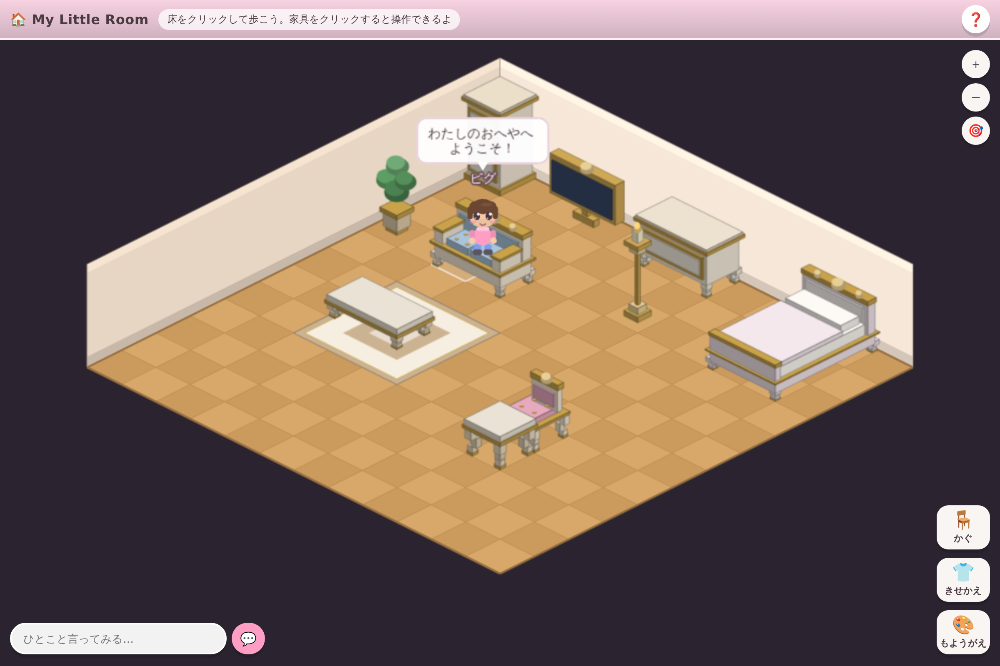

# ピグっぽい箱庭ゲーム ─ My Little Room

ブラウザだけで遊べる、アメーバピグ風の等角（アイソメトリック）箱庭ゲームです。
自分の部屋にアバターを歩かせ、家具を並べ、きせかえを楽しめます。
家具は猫脚（カブリオレレッグ）と金彩を効かせたロココ調で、画像を使わず
すべてコードから描いています。
サーバーは不要で、進行状況はブラウザの `localStorage` に自動保存されます。



## できること

| 機能 | 操作 |
| --- | --- |
| アバターが歩く | 床をクリック（A* で家具を避けて移動） |
| 家具に座る | イス・ソファ・ベッドをクリック。もう一度クリックで立つ |
| 家具を買う／売る | 「かぐ」→ **ショップ**タブ。52種をコインで購入、いらない家具は半額で売却 |
| きょうの やること | 右上の **📋**。日替わり3件のミッション。達成でコイン。1日1回ログインボーナス（連続日数で増額） |
| 家具を置く | 「かぐ」→ アイテムを選ぶ → 部屋をクリック |
| 家具を回す | 配置中／選択中に `R`、または「↻ 回転」 |
| 家具を動かす・しまう | 置いてある家具をクリック → 「✥ 移動」「📦 しまう」 |
| **壁に掛ける** | 「かぐ」→ **かべ**タブ。窓・絵・時計・燭台・鏡・壁棚・タペストリーの10種を、左右の壁の上下2段に掛けられます |
| **いろをかえる** | 家具をクリック → 「🎨 いろ」。木地10色 × 張地10色。同じ家具でも別の一台になります |
| きせかえ | **大きなプレビュー**を見ながら、髪型6種・髪色・肌・**ひとみの色**・**ふくのかたち（シャツ / ワンピース）**・服の色・ズボン（ワンピースならくつした）・靴・なまえ |
| もようがえ | 「もようがえ」から床と壁のデザイン |
| **おへやを ひろげる** | 「もようがえ」→ ひろげる。12×12 → 14×14 → 16×16 → 20×20 をコインで解放（置いてある家具はそのまま） |
| ひとこと言う | 画面左下の入力欄。アバターの上に吹き出しが出る |
| おまかせ | 10秒ほど操作しないと、アバターが自分で歩く・座る・エモートする。触ればすぐ止まる。「きもち」パネルで ON/OFF |
| モーション | 「きもち」から10種（てをふる・はくしゅ・おじぎ・よろこぶ・おどる・わらう・すき・びっくり・しょんぼり・ねむる）。座ったままでも出せる。**おどる・ねむるは繰り返し**、もう一度おすか歩き出すと止まる |
| カメラ | 背景をドラッグ（スマホは1本指スワイプ）で移動。ホイール・2本指ピンチ・`＋`/`−` でズーム、`🎯` でアバターへ |
| **部屋をみせる** | 「みせる」→ おへやの名前とひとことを付けて **URL をコピー**。サーバー無しで、部屋の中身が URL に載る |
| **人の部屋を訪ねる** | 共有 URL を開くと**自分のアバターでその部屋を歩ける**（読み取り専用）。❤️ いいねでハートが飛ぶ |
| **部屋をとりこむ** | 訪問中に「この部屋をとりこむ」。**共有 URL がバックアップも兼ねる**ので、記録が消えても復元できる |
| **画像でほぞん** | 「みせる」→ 📷。部屋の名前を焼き込んだ PNG を保存（SNS 投稿用） |
| セーブ | すべて自動保存。「部屋をリセットする」で初期状態へ |

キーボード: `R` 回転 / `Esc` 配置や選択の解除。

## 動かす

```bash
npm install
npm run dev        # 開発サーバー（http://localhost:5173）
npm run build      # 型チェック + テスト + 本番ビルド（dist/ に出力）
npm test           # ユニットテスト（Vitest）
npm run preview    # ビルド結果の確認
```

`vite.config.ts` の `base` は `./` なので、`dist/` をそのままサブディレクトリ配信の
静的ホスティングに置けます。画像アセットは一切使わず、家具もアバターも実行時に
コードから描画しているため、追加のファイルはありません。

## GitHub Pages への公開

`.github/workflows/deploy-pages.yml` が、既定ブランチへの push（と手動実行）で
`npm run build` を走らせ、`dist/` を GitHub Pages へ配信します。公開先は
<https://shuji30.github.io/pig/> です。

**初回だけ手作業が必要です。** Pages の有効化はワークフローの `GITHUB_TOKEN` から
できない（`Resource not accessible by integration`）ため、先に次の設定を済ませてください。
これが未設定のあいだ、`build` ジョブは成功しますが `deploy` ジョブが
`Ensure GitHub Pages has been enabled` で失敗します。

1. <https://github.com/shuji30/pig/settings/pages> を開き、**Build and deployment**
   の Source を **GitHub Actions** にする
   - このリポジトリは private です。private リポジトリの Pages は有料プラン
     （Pro / Team 以上）が必要なので、Free プランの場合は Settings → General →
     Danger Zone からリポジトリを public にすると使えるようになります。
2. Actions タブ → *Deploy to GitHub Pages* → **Run workflow** で再実行
   （既定ブランチへ push しても同じ）

`build` ジョブは Pages の設定に関係なく完走するので、有効化前でも実行結果の
Artifacts から `github-pages`（`dist/` の中身）をダウンロードできます。

既定ブランチを変えたときは、ワークフローの `on.push.branches` も合わせて直してください。

## 構成

```
src/
  main.ts                     Phaser の起動
  config.ts                   タイルサイズ・部屋の広さ・パレットなどの定数
  types.ts                    家具・アバター・セーブデータの型
  core/
    iso.ts                    等角座標の変換（グリッド ⇔ 画面）と重ね順
    pathfinding.ts            4方向 A*（家具を障害物として扱う）
    placement.ts              置けるか の判定（純粋関数。テストしやすいよう切り出し）
    wall.ts                   壁面のスロット計算（壁の (u, h) ⇔ 画面座標）
  data/
    furniture.ts              家具カタログと初期レイアウト
    missions.ts               日替わりミッションの定義
    motions.ts                モーション／エモートの定義
  render/
    color.ts                  色の陰影計算
    room.ts                   床と壁の描画
    furnitureTexture.ts       家具テクスチャの実行時生成（回転4方向ぶん）
    wallTexture.ts            壁に掛ける家具の生成（壁の傾きに合わせた平行四辺形）
    avatarArt.ts              アバターの絵（紙人形方式へ替えるときの差し替え点）
    avatarPreview.ts          きせかえ用の大きなプレビュー
    snapshot.ts               PNG の書き出し（部屋の名前を焼き込む）
  entities/
    Avatar.ts                 アバターの描画・歩行・座り・吹き出し・モーション
    AutoPlay.ts               放置中の自動行動（おまかせ）
    FurnitureLayer.ts         設置済み家具、占有マス、当たり判定、重ね順
    WallLayer.ts              壁に掛けてある家具（壁の面 × 段で管理）
  scenes/RoomScene.ts         入力・モード管理・カメラ・保存の取りまとめ
  ui/ui.ts                    DOM 側の UI（パネル・カタログ・チャット）
  state/
    save.ts                   localStorage への保存・初期データ・版の移行（部屋ごとの `RoomData`）
    economy.ts                コイン・売買・ボーナス・ミッションの受け取り
    share.ts                  部屋を URL に載せる／読む（検証つき）
    metrics.ts                端末内の計測カウンタ（外へは送らない）
```

`*.test.ts` は同じ階層に置いてあります（`npm test` で 105 件）。

### 描画のしくみ

- 1タイルは 64×32px のひし形。`gridToScreen()` / `screenToTile()` で相互変換します。
- 家具は「背面が `v=0`、正面が `v=D`」というローカル座標で直方体を組み立て、
  回転に応じてグリッドへ写して描きます（`furnitureTexture.ts`）。
  等角では描く順番がそのまま前後関係になるため、直方体どうしの位置関係を比較して
  奥から順に並べ替えてから描画しています。
- アバターと家具の前後関係は、単一の depth 値では正しく表せない配置があるため、
  アバターの位置ごとに「奥にある家具」「手前にある家具」を調べて depth を決めています
  （`FurnitureLayer.depthAt()`）。
- リカラーは形の生成コードを触りません。`PlacedFurniture.recolor` に色の差し替えを持たせ、
  テクスチャのキャッシュキーに色を含めるだけです（`recolored()`）。
  木地10色 × 張地10色なので、52種の家具が見た目 5200 通りになります。
  **金彩（`GOLD`）はあえて変えない**ので、色を変えてもロココの統一感が崩れません。
- 壁に掛けるものは床のグリッドとは別の座標系です。壁の上の位置を
  「壁に沿った距離 `u`」と「床からの高さ `h`」で表し、
  `right`（gy=0 の壁）は `x = u, y = u/2 - h`、`left`（gx=0 の壁）は `x = -u, y = u/2 - h`
  で画面へ写します（`core/wall.ts`）。この式は逆にも解けるので、
  クリックした点がどの壁のどのスロットかを一発で求められます。
  矩形は画面上では傾いた平行四辺形になるため、頂点を自分で計算して塗っています。

### 部屋のデータの持ちかた

- セーブは `rooms: Record<string, RoomData>` ＋ `currentRoom` の形です。`RoomData` は
  名前・ひとこと・床・壁・**広さ**・家具・立ち位置 を持ちます。部屋を増やす（月コロニーなど）ときは
  この Record に1件足すだけで、描画・経路探索・共有はそのまま動きます。
- 部屋の広さは正方形の一辺（`size`）で、12 / 14 / 16 / 20 の4段。定数ではなく部屋ごとの値なので、
  `RoomView` / `FurnitureLayer` / `findPath` へ引数として渡しています。
- セーブの版が上がるたび `migrate()` に1段足します（いまは version 4）。
  **既存プレイヤーの部屋を消さない**のが絶対条件で、`state/save.test.ts` で
  v1 / v3 / v4 それぞれからの移行を固定しています。

### 部屋を URL に載せるしくみ

- 部屋の中身（床・壁・名前・ひとこと・アバター・家具の配置）を短い配列に詰め、
  `CompressionStream('deflate-raw')` で圧縮して base64url にし、`#r=…` としてハッシュに載せます。
  家具11個で **232文字**。`CompressionStream` が無いブラウザでは無圧縮形式（`p…`）にそのまま落ちます。
- **サーバーは1台も使いません。** 部屋の中身は URL のなかだけにあります。
- 共有 URL は他人が書いた入力なので、読む側で全項目を検証しています（`state/share.ts`）。
  カタログに無い家具は捨て、座標は回転後の大きさで部屋の中へ丸め、色は `#rrggbb` 以外を既定色に落とし、
  名前からは制御文字を除いて長さを切ります。この挙動は `state/share.test.ts` で固定してあります。

## ロードマップ

ゲームとしてのループは **v0.3 で一周しました**（目的 → 集める → 飾る → 見せる）。
残っている穴は「反応がオーナーに返る」の1か所で、これはサーバーが必要なため v1.0 の判断待ちです。

**あつめる → みせる → そだてる → とびだす → いきている → いっしょに** の全体計画と、
各フェーズの完了条件・見る数字・実装の当たり所は [docs/ROADMAP.md](docs/ROADMAP.md) にあります。

次の要点だけ：

- ⚠️ 大型家具を増やす前に、家具どうしの重なり順をトポロジカルソートへ直す
- 床の部分張り替えと、部屋テーマのプリセット
- そのあと **v0.4.5 とびだす**（ロケット → 月コロニー。2つめの部屋として作る）。
  複数部屋の土台は済んでいるので、`rooms` に1件足すところから始められます

マルチプレイは効果が最大ですが運用コストも最大なので、v0.3 の共有の数字を見てから投資します。
