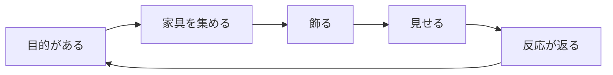

# ロードマップ ― My Little Room

## この文書の読み方

- フェーズは **どこで止めても遊べる形** で切っています。途中で方針を変えても捨てる作業が出ません。
- 規模は「1人開発・週10〜15時間」を前提にした**目安**です。人数が増えれば当然変わります。
- ★ がそのフェーズの主目的。それ以外は余力しだいで落として構いません。
- KPI の数値は**仮説として置いた目標値**です。実測が取れたら差し替えてください。

---

## 進捗（2026-08-21 時点）

| Ver | テーマ | 状態 | 中身 |
| --- | --- | --- | --- |
| v0.1 | 飾る（土台） | ✅ 完了＋磨き込み | 等角の部屋、配置/移動/回転/しまう、きせかえ、保存、Pages 公開、ピンチズーム |
| **v0.2** | **あつめる** | ✅ **機能は完了** | コイン、ショップ（52種）、売却、日替わりミッション3件、ログインボーナス＋連続日数、セーブ移行 |
| **v0.3** | **みせる** | ✅ **機能は完了** | URL 共有（deflate + base64url）、訪問モード、部屋のとりこみ、PNG 保存、計測カウンタ |
| **v0.4** | **そだてる** | ✅ **完了** | 部屋の拡張（12→14→16→20）、`SaveData` の複数部屋化、壁面レイヤー（10種）、家具のリカラー、床の1マス張り替え、部屋テーマ5種 |
| **v0.4.5** | **とびだす** | ✅ **S段＋M段 完了** | ロケット家具 → 月コロニー（14×14）、低重力歩行、月家具10種、**月面限定ミッション6種**／未：共有月面広場（L段。v0.3 の数字が条件） |
| v0.5 | いきている | 🔶 2/6 | ✅ エモート10種＋表情7種、✅ おまかせ（放置中の自動行動）／未：家具インタラクション、時間帯、ペット、スタンプ |
| v1.0 | いっしょに | ❌ 未着手 | マルチプレイ（v0.3 の数字が条件） |

### ループの現在地

| ループの位置 | 状態 |
| --- | --- |
| 目的がある | ✅ 日替わりミッション3件 |
| 家具を集める | ✅ コインとショップ（52種、レア度3段） |
| 飾る | ✅ 既存 |
| 見せる | ✅ URL 共有・訪問モード・PNG 保存 |
| 反応が返る | 🔶 訪問中の ❤️ は**押した端末のなかだけ**。オーナーに届くのは v1.0 |

**ループは一周しました。** 目的（ミッション）→ 集める（ショップ）→ 飾る → 見せる（URL）まで
つながっています。残っているのは「反応がオーナーに返る」の1か所だけで、
それはサーバーが必要なので v1.0 の判断待ちです。

### 片づいたやり残し

- ✅ **計測カウンタ**（`state/metrics.ts`）。北極星指標「部屋を編集した日数」を端末内で数える。
  「あそびかた」パネルの一番下に出る。どこにも送信しない
- ✅ **コアのユニットテスト**（Vitest）：`core/iso`、`core/pathfinding`、`core/placement`、`state/share`。
  `npm test` で走り、`npm run build` にも組み込んである
- ✅ **置ける判定の切り出し**（`core/placement.ts`）。`FurnitureLayer` から純粋関数へ出したのでテストできる

### v0.4 でやったこと

- ✅ **おへやを ひろげる**：12×12 → 14×14 → 16×16 → 20×20 をコインで解放（900 / 1900 / 3400）
- ✅ **`SaveData` の複数部屋化**（version 4）。v0.4.5 の月コロニーの前提が整った
- ✅ **壁面レイヤー**（version 5）：窓2種・絵3種・鏡・時計・燭台・壁棚・タペストリーの10種を、
  左右の壁の上下2段に掛けられる。共有 URL にも載る
- ✅ **家具のリカラー**：置いた家具を1台ずつ、木地10色 × 張地10色に変えられる。
  形の生成コードは触っていないので、**52種の家具が見た目 5200 通り**になった
- ✅ **家具どうしの重なり順をトポロジカルソートにした**。スカラー近似をやめたので、
  縦に長い家具の横に小物を置いても前後が崩れない
- ✅ **床の1マス張り替え**（version 6）：「ぬる柄」を選んで床をなぞると1マスずつ変わる。
  部屋の基本の柄を選べば消しゴムになる。共有 URL にも載る
- ✅ **部屋テーマ5種**（ロココ / サロン / ローズ / ミント / よぞら）：床と壁をひとおしで替える。
  「何を選べばいいか分からない」を解く入口で、そこから個別に触ってもらう
- ✅ ユニットテスト 122 件

### まだ残っていること

- 家具は52種あるが、箱の形を共有している小物は見分けがつきにくい。
  色で描き分けたが、形のバリエーション（丸い箱、脚つき、扉つき）はまだ少ない
- 訪問中の ❤️ はオーナーに届かない（サーバーが無いため。スクリーンショットに数が残るだけ）
- 共有 URL は「その時点のコピー」。オーナーが部屋を変えても、配った URL は古いまま

### v0.4.5 でやったこと（S段）

- ✅ **ロケット**（2×2・高さ118）を置いて押すと**月コロニー**へ行ける。1500コイン
- ✅ **月コロニー**：14×14 の2つめの部屋。月の砂の床と星空の壁。
  着いた時点で家具8個＋壁2個が置いてある（「部屋だけ作って置かない」を避けるため）
- ✅ **低重力歩行**：月では歩くとひと足ごとにふわっと浮く（影も小さくなる）
- ✅ **帰る導線は二重**：月のロケットを押す／右上の 🌍 を押す。
  ロケットをしまってしまっても帰れなくならない
- ✅ **宇宙ロココの家具10種**：つきのスツール／カナッペ／げっせきのテーブル／
  ほしのランプ／ドームのしょくぶつ／クレーターラグ／ロケットのもけい／ロケット／
  ほしのちず（壁）／ちきゅうのまど（壁）
- ✅ 月の部屋も共有 URL に載る（346文字）

- ✅ **月面限定ミッション6種**：つきへ行く／つきのおへやを12個にする／つきにすわれる家具を2つ／
  つきにかざりを3つ／つきのかべに3つ／つきのゆかにラグ。
  **月コロニーができてから**出る（達成できない課題は出さない）。
  地上の3件とは**別枠で1件足す**形にしたので、月ができた日に地上のやることが入れ替わらない

### 次にやること

1. **判断ゲートの計測**：月の部屋の設置家具数の中位値が1週間で8個に届くか。
   届かないなら行き先を増やすのは止めて、1部屋の密度に投資を戻す
2. v0.5「いきている」の残り（家具インタラクション、時間帯、ペット、スタンプ）
3. L段（共有月面広場）は v1.0 のマルチプレイと同じ条件。v0.3 の数字を見てから

> **ロケット → 月コロニーの置き場所について。**
> 要望としては筋が良く、やる価値があります。ただし **v0.3「みせる」より先には入れません。**
> いま開いている穴は「作った部屋が誰にも見られない」ことなので、行き先を増やすと
> **誰にも見られない部屋が2つになるだけ**になります。
> 複数部屋の土台（`SaveData` の部屋分割・部屋サイズの可変化）が v0.4 に入っているため、
> **v0.4 の直後（v0.4.5）が最も安く作れる位置**です。詳細は「4. フェーズ詳細」の v0.4.5 を参照。

---

## 1. コンセプト

> **5分で「自分の部屋」が良くなって、そのままURLで人に見せられる箱庭。**

| | |
| --- | --- |
| プラットフォーム | ブラウザ（PC / スマホ）。インストール不要、アカウント不要で即プレイ |
| 想定プレイヤー | 昔ピグや箱庭系で部屋を作っていた層。1日5〜10分、ちょこちょこ触る |
| セッション設計 | 1回3〜5分 × 1日1〜2回。腰を据えて遊ぶゲームにはしない |

### 3本の柱

1. **自己表現** ― 部屋とアバターが「自分そのもの」になること。判断に迷ったら、表現の幅が増える方を選ぶ。
2. **見せられる** ― 作ったものを人に見せて反応が返ること。箱庭の満足はここで完成する。
3. **毎日ちょっと変わる** ― 訪れるたび小さな変化がある。大きな更新より、小さな新着。

---

## 2. 現状（v0.1）と、ループの穴

v0.2 で「目的」と「集める」が入り、ループは**「見せる」の1か所だけ**が開いた状態になりました。
（この節は v0.1 時点の分析。現在地は上の進捗を参照）

| ループの位置 | 現状 | 何が起きるか |
| --- | --- | --- |
| 目的がある | ✗ なし | 何をすればいいか分からない |
| 家具を集める | △ 最初から全部持っている | 集める喜びがゼロ。カタログを一巡したら終わり |
| **飾る** | ◎ 実装済み | ここは強い。手触りは良い |
| 見せる | ✗ なし | 作っても誰にも見られない |
| 反応が返る | ✗ なし | 続ける理由が生まれない |

**したがって最短の勝ち筋は「集める(v0.2) → 見せる(v0.3)」の順でループを閉じること。**
マルチプレイは効果が最大ですがコストと運用負荷も最大なので、先に v0.3 の URL 共有で
「見せたい需要が本当にあるか」を安く測ってから投資します。

---

## 3. 全体像

| Ver | テーマ | 主目的 | 規模の目安 |
| --- | --- | --- | --- |
| v0.2 | **あつめる** | 家具を集める動機と、毎日来る理由をつくる | 2週 |
| v0.3 | **みせる** | サーバー無しで部屋を共有し、需要を測る | 2週 |
| v0.4 | **そだてる** | 表現の天井を上げる（部屋拡張・壁面・リカラー） | 3週 |
| v0.4.5 | **とびだす** | 2つめの部屋を「行き先」として与える（ロケット／月コロニー） | 1〜2週 |
| v0.5 | **いきている** | 何もしていない時間をかわいくする（演出・生活感） | 3週 |
| v1.0 | **いっしょに** | 同じ部屋に他人がいる（マルチプレイ） | 6週＋運用 |

---

## 4. フェーズ詳細

### v0.2 あつめる ― 経済とコレクション

**目的** ★ サンドボックスに「獲得」の軸を入れる。カタログをショップに変える。

**入れるもの**

- コイン。ショップで家具を購入。未所持の家具はショップに並ぶが設置はできない
- デイリーボーナス（初回訪問でコイン）＋ 連続日数のささやかな増分
- **模様替えミッション**（3件程度を日替わり）：「いすを3つ置く」「壁と床を同じ系統に」「ラグの上に机を置く」など、
  達成が**部屋を触ること自体**になる課題にする。作業感を出さないのが要点
- 家具を 21 種 → 50 種前後へ。レア度（ふつう / すこしレア / レア）で価格帯を分ける
- 「しまう」で売却も可能に（買値の半額）

**完了条件（DoD）**

- 初回起動時、部屋に置かれていない未所持家具が存在し、コインで買える
- 1日1回訪れると必ず何かもらえる／達成できるものがある
- 既存プレイヤーの部屋・アバター・所持家具が消えずに移行できる

**見る数字**

- D1 復帰率（目標 30%）／ 初回セッションでの購入数（目標 1件以上が 60%）
- ミッション達成率。3件中1件も達成されないなら課題設計を見直す

**実装の当たり所**

- ⚠️ **先にセーブのマイグレーションを作ること。** `state/save.ts` の `load()` は現在
  `parsed.version !== SAVE_VERSION` で `defaultSave()` に落ちるため、`SAVE_VERSION` を上げると
  **既存プレイヤーの部屋が消えます。** `migrate(v1 → v2)` を挟む形に変えるのが v0.2 の最初のタスク
- `SaveData` に `coins` / `owned`（所持数と別に「解禁済み」）/ `missions` / `lastVisit` を追加
- `FurnitureDef` に `price` と `rarity` を追加（型は `src/types.ts`）
- 家具の描画は手続き生成なので、**追加コストはデータ1行＋色の指定だけ**。ここが本作の構造的な強み。
  50種への拡張は `data/furniture.ts` の編集でほぼ済む
- 新規モジュール：`data/missions.ts`、`state/economy.ts`。UI は「かぐ」パネルにショップタブを追加

---

### v0.3 みせる ― 共有と訪問

**目的** ★ 作った部屋を他人に見せられるようにする。**サーバーを持たずに**。

**入れるもの**

- 「みせる」ボタン → 部屋の状態を圧縮して URL に埋め込み、コピー
- **訪問モード**：共有 URL を開くと、その部屋を自分のアバターで歩ける（読み取り専用・保存しない）
- 訪問先で「いいね」を押すと、URL に戻り値が乗らない代わりに**スクリーンショットに反映**される軽い演出
- キャンバスから PNG 保存（SNS 投稿用。ロゴと部屋名を焼き込む）
- 部屋名とひとことの設定

**完了条件（DoD）**

- URL ひとつで他人の部屋に入って歩ける。サーバー費用ゼロ
- スマホで共有 → 別端末で開く、が成立する
- 共有 URL がバックアップも兼ねる（localStorage が消えても復元できる）

**見る数字**

- 共有ボタンの押下率（目標 セッションの 15%）／共有 URL の開封数
- ここが伸びないなら **v1.0 のマルチプレイは投資しない**。判断ゲートとして使う

**実装の当たり所**

- `state/share.ts`：`CompressionStream('deflate-raw')` + base64url。家具20個で 1KB 未満なので URL に十分載る
- `RoomScene` に `mode: 'own' | 'visit'`。visit では編集 UI を隠し `persist()` を無効化。
  歩行・座る・カメラはそのまま使える（既存コードに手を入れる箇所が少ない）
- スクリーンショットは `game.renderer.snapshot()`。UI は DOM 側なので写らない点に注意（枠は別途描く）

**やってみて分かったこと（実装後の記録）**

- 家具11個で URL は **232文字**。deflate が効いていて、家具20個でも 600文字を切る。URL 長は問題にならない
- 共有 URL は**他人が書いた入力**なので、読む側で必ず検証する。実装では
  カタログに無い家具を捨て、座標を部屋の中へ丸め（回転後の大きさで判定）、色は `#rrggbb` 以外を既定色に落とし、
  名前から制御文字を除いて長さを切り、家具200個で打ち切っている。ここは `state/share.test.ts` で17件の
  テストに落としてある
- 非同期の展開があるので、**ゲームの起動前に URL を読む**必要がある（`main.ts` で読んでから
  `new RoomScene(shared, broken)` に渡す）。シーンの中で読もうとすると1フレーム分の描画が二度手間になる
- 「とりこむ」で持ちものを増やさないこと。置いてあるぶんを持ちものに加算すると、
  取りこみ → しまう → 売る でコインが無限に増える

---

### v0.4 そだてる ― 表現の天井を上げる

**目的** ★ 「置く場所がない／似た部屋になる」を解消する。

**入れるもの**

- 部屋の拡張：12×12 → 16×16 → 20×20 をコインで解放
- ✅ **壁面レイヤー（実装済み）**：窓、絵画、壁時計、壁掛け照明。等角の箱庭で最も「部屋らしさ」が伸びる要素
- ✅ **家具のリカラー（実装済み）**：同じ形で色違い。木地10色 × 張地10色
- ✅ **床の部分張り替え（実装済み）**：タイル単位。なぞって塗れる
- ✅ **部屋テーマのプリセット（実装済み）**：ロココ / サロン / ローズ / ミント / よぞら
- ✅ **複数部屋（土台は実装済み）**。2部屋目の中身は v0.4.5 の月コロニーで入る

**完了条件（DoD）** ✅ 達成

- 壁に物が掛かる。床が1マス単位で塗れる。同じ家具で色の違う部屋が作れる

**やってみて分かったこと（実装後の記録）**

- ✅ **部屋の広さを可変にした。** `ROOM_W / ROOM_H` を捨て、`RoomData.size`（正方形の一辺）に持たせて
  `RoomView.redraw(floor, wall, size)` / `FurnitureLayer(scene, size)` / `findPath(..., size, size)` へ渡す形にした。
  広さは 12 → 14 → 16 → 20 の4段で、コイン（900 / 1900 / 3400）で解放する。**狭くは戻せない**
  （置いてある家具が部屋の外に出てしまうため）。UI は「もようがえ」の一番下
- ✅ **壁面レイヤーを入れた**（version 5）。床のグリッドとは別の座標系で、壁の上の位置を
  「壁に沿った距離 `u`」と「床からの高さ `h`」で持つ（`core/wall.ts`）。画面への写しは
  `right: x = u, y = u/2 - h` / `left: x = -u, y = u/2 - h` で、**この式は逆にも解ける**ため
  クリックした点がどの壁のどのスロットかを一発で求められる。矩形は画面上では平行四辺形に
  なるので、頂点を自分で計算して塗っている（`render/wallTexture.ts`）。
  スロットは (壁の面 × 列 × 上下2段) で、重なりは同じ面・同じ段の列の重なりだけを見る
- ✅ **家具のリカラーを入れた。** `PlacedFurniture.recolor` に色の差し替えを持たせ、
  テクスチャのキャッシュキーに色を含めた。**形の生成コードは1行も触っていない**のに
  見た目が100通りに増える、というのが手続き生成のいちばんおいしいところ。
  **金彩（`GOLD`）はあえて変えない**のでロココの統一感が崩れない
- ✅ **`SaveData` を複数部屋化した**（version 4）。`rooms: Record<string, RoomData>` ＋ `currentRoom`。
  `RoomData` は 名前・ひとこと・床・壁・広さ・家具・立ち位置 を持つ。v3 までの平らな形は
  `migrate` が `rooms.home` へ移す。**v0.4.5 の月コロニーは、この Record に1件足すだけで置ける**
- 訪問モードも同じ形に乗せた（その場かぎりの `visit` 部屋を1件だけ持つセーブを組み立てる）ので、
  部屋の切り替えと訪問で別々のコードにならずに済んでいる
- 移行では**部屋の外に出ている家具を回転後の大きさで中へ収める**。広さの概念が入ったので、
  壊れたセーブや細工された共有 URL で家具が壁の外に出る道を塞いでおく必要がある
- 共有 URL の形式を 2 に上げた（広さを末尾に追加）。**形式1の古い URL も読める**（12×12 として扱う）

**実装の当たり所**

- ~~`ROOM_W / ROOM_H` は定数なので、`RoomState` に持たせて `RoomView` / `FurnitureLayer` / `pathfinding` へ渡す形に変更~~ ✅ 完了
- ~~壁面は床グリッドと別物。`WallLayer` を新設し、壁の (辺, 列, 高さ) をスロットとして持たせる~~ ✅ 完了
- ~~リカラーは `getFurnitureTexture()` のキャッシュキーに色を含めるだけで済む~~ ✅ 完了（読み通り、それだけで済んだ）
- ✅ **重なり順をトポロジカルソートにした**（`core/depthSort.ts`）。
  スカラー近似（`depthFor()`）は「縦に長い家具の横に小物」で崩れる。
  例：1×6 の家具（gy が大きいのでスカラーが大きい）の横に 3×1 を置くと、
  奥にあるはずの縦長が手前に描かれてしまう。
  そこで**「画面上で重なりうる」組にだけ辺を張って**並べ替える。
  対角に離れた組はどちらも「奥」と言えてしまうが、画面で重ならないので辺を張らない。
  矛盾して閉路になったらスカラーの小さいものから出して進める。
  並び順は入力順に依存しない（同じ部屋なら常に同じ結果）。
  家具の深さは 0, 10, 20 … と並び、アバターはそのすき間に入る（`depthAt()`）

---

### v0.4.5 とびだす ― ロケットと月コロニー

**プランナーの結論**

> **やる価値はある。ただし「乗り物」ではなく「2つめの自分の部屋」として作る。**
> そして **v0.3「みせる」を閉じたあとに着手する。** 順番を逆にすると、
> 誰にも見られない部屋が2つになるだけで終わります。

#### なぜ価値があるか（3本の柱への当たり）

| 柱 | 効き方 |
| --- | --- |
| 自己表現 | ◎ 部屋が2つになる。「地上＝生活の部屋 / 月＝見せる用の作品」と使い分けが生まれる |
| 見せられる | ◎ 「月に部屋がある」は共有するときの一言になる。共有 URL の開封率に直接効く題材 |
| 毎日ちょっと変わる | ○ 行き先が増えるのは**1回きりの変化**。日々の変化は月面限定ミッションで別に作る必要がある |

北極星指標（1日1回以上 部屋を編集したユーザー数）に対しては、**編集できる面積が2倍になる**ため
素直に効きます。ただし裏返しのリスクとして「1部屋あたりの密度が半分になる」があり、これは下で測ります。

#### いちばんの誤解ポイント

面白いのは**月ではなくロケット**です。「押すと飛ぶ家具が自分の部屋にある」ことが体験の中心で、
月コロニーは**その行き先が実在することを保証する**役割にすぎません。したがって、

- ロケットは **v0.5「家具インタラクション」の最上位事例**として設計する
- 月コロニーは **v0.4「複数部屋」の最初の実例**として設計する

**新しいゲームモードを作ってはいけません。** 既存の歩行・座る・配置・きせかえ・カメラが
そのまま動く場所を1つ増やす、というだけの実装に収めます。

#### やってはいけない形（先に潰しておく）

- ❌ **いきなり「みんなが集まる月面広場」にする。** それは v1.0 のマルチプレイそのものです。
  サーバー費・モデレーション・年齢層への配慮が一気に発生します。着手条件は v0.3 の数字（5章）
- ❌ **移動に待ち時間・燃料・回数制限を置く。** 課金の入口になり Non-goals に触れます。
  **移動は常に即時・無料・何度でも。** 行き来のストレスがゼロであることが前提
- ❌ **月をSF一色にする。** 既存52種はロココです。世界観が割れると「別のゲームの画面」になります。
  → **「宇宙ロココ」**（月面のサロン：ドーム窓、星空、青銀のパレット）で統一し、
  `furnitureTexture.ts` の `cabriole` / `tufted` をそのまま流用する
- ❌ **月に行かないと手に入らない基本家具を置く。** 行き先は「ごほうび」であって「関所」にしない

#### 規模を3段に切る（どこで止めても遊べる）

| 段 | 規模 | 入れるもの |
| --- | --- | --- |
| ✅ **S 最小** | 3〜4日 | ロケット家具（置ける・押すと発進）、発進演出、月コロニー（固定サイズの2つめの部屋・独自の床と壁）、月家具 6〜8種、地上へ帰る導線 |
| ✅ **M 本命** | ＋1週 | ✅ 低重力歩行、✅ 地球が見える窓、✅ 常時星空（星空の壁）、✅ 月面限定ミッション／見送り：月面限定家具の入手経路（「行き先を関所にしない」ため、月家具は地上のショップでも買える） |
| **L 将来** | v1.0 以降 | 共有月面広場（他人が来る）。**v0.3 の数字が着手条件** |

S だけでも「ロケットを押したら月にいる」は成立します。**M の低重力歩行が費用対効果の山**で、
`Avatar` の歩行に上下オフセットを1本足すだけで「月にいる感じ」が出ます。

#### 完了条件（DoD）

- 部屋に置いたロケットを押すと月コロニーへ行き、月から地上へ帰れる。**両方の部屋が別々に保存される**
- 月コロニーでも配置・回転・しまう・きせかえ・カメラ・おまかせが**そのまま**使える（別実装をしない）
- 既存プレイヤーのセーブが「部屋1つ」の状態から「地上＋月」へ壊れずに移行できる
- 月の部屋も共有 URL に載る（v0.3 の `share.ts` に部屋の指定を足すだけで済む形にする）

#### 見る数字

- **2つめの部屋を持ったユーザーの D7 復帰**（1部屋のユーザーとの差を見る）
- **月コロニーの設置家具数の中位値。1週間で 8個に届かないなら、行き先を増やすのは止める。**
  そのときは1部屋の密度（v0.4 の壁面・リカラー）に投資を戻す ── **判断ゲートとして使う**
- 共有 URL の開封率が「地上の部屋」と「月の部屋」でどちらが高いか。
  月が高ければ「行き先」は共有の題材として正しい、という証拠になる

#### 実装の当たり所（やってみた記録）

- ✅ `SaveData` の複数部屋化は v0.4 で済んでいたので、**月は `rooms` に1件足すだけ**で置けた
  （`makeMoonRoom()`）。広さ 14 は既に `ROOM_SIZES` にあるのでそのまま通る
- ✅ ロケットは `FurnitureDef.travel`（行き先の部屋 id）1本で済んだ。
  **行き先にもう居るなら地上へ帰る**という約束にしたので、
  行きと帰りでロケットの定義を分けなくてよい
- ✅ 発進演出は `cameras.main.fadeOut/fadeIn`（白）＋部屋の作り直しで足りた。**専用シーンは作っていない**
- ✅ 低重力歩行は `Avatar` の `bodyWrap`（container の中）を歩幅ごとに持ち上げるだけ。
  **container を動かさないのでマス座標に影響しない**（歩行中にモーションを止めているのと同じ理屈）。
  影は既に「浮いた高さで小さくなる」実装だったので、そのまま効いた
- ✅ 星空は色調フィルタではなく**壁のプリセットを1つ足すだけ**で足りた（`WALL_STYLES` に「ほしぞら」）。
  床も「つきのすな」を足し、テーマ「つき」でひとおしで替えられる
- ✅ 月家具はデータ行＋色指定だけ。**ロケットだけは専用の形**（`shape: 'rocket'`）を書いた。
  箱しか置けないので、胴9段＋ノーズ6段の階段で円錐に近づけている
- ⚠️ 床と壁の柄を足したら、共有 URL の検証が **0〜4 のハードコード**だったので配列の長さに直した。
  こういう「増やしたときに置いていかれる上限」は、足すたびに探す必要がある
- ⚠️ 月のミッションのために日ごとのカウンタを1つ増やしたら、**古いセーブでその項目が
  undefined のまま**になり、ミッションの進みが NaN になる道があった。
  読み込みで全項目を 0 で埋める（`cleanDaily`）1か所に寄せて塞いだ。
  **数え方を増やすときは必ずここを通す**
- ミッションの「○○を置いておく」は**いま居る部屋**の家具で数える。
  月にいれば月の家具で進む。「どちらの部屋の話か」を考えずに済むほうが分かりやすいため

---

### v0.5 いきている ― 生活感と演出

**目的** ★ 何もしていない時間を「かわいい」にする。滞在時間と再訪の質を上げる。

**入れるもの**

- ✅ **アバターのモーション／エモート（実装済み）**：10種（てをふる・はくしゅ・おじぎ・
  よろこぶ・おどる・わらう・すき・びっくり・しょんぼり・ねむる）。表情7種と頭上の
  絵文字を伴い、歩行中・着席中でも出せる。おどる・ねむるは繰り返し再生で、
  もう一度おすか歩き出すと止まる。まばたきと呼吸も入っている
- ✅ **おまかせ＝放置中の自動行動（実装済み）**：10秒無操作でアバターが自分で歩く・
  座れる家具へ行って座る・エモートする。何か操作すればすぐ止まり、待ち時間から数え直す。
  ON/OFF は「きもち」パネルで切り替えでき、設定は保存される（`entities/AutoPlay.ts`）
- 家具インタラクション：ベッドで寝る、テレビを見る、ピアノを弾く、鏡を見る（座る仕組みの拡張）
- 時間帯（朝・昼・夕・夜）で壁と床の色調が変わる。夜はランプが点く
- ペット（歩き回る小さなアバター）と、たまに来る NPC の来客
- 放置アニメ（あくび、伸び、鼻歌）── おまかせの行動リストに足せる
- エモートのスタンプ化（吹き出しに絵柄を出す）

**完了条件（DoD）**

- 30秒操作しなくても画面が退屈にならない
- 家具の半分以上に「クリックすると何か起きる」がある

**実装の当たり所**

- `FurnitureDef` の `seatHeight` を `interactions: { kind, pose, lift }[]` に一般化
- 時間帯は `RoomView.redraw()` に色調フィルタを1段足すだけ（実装が軽く、効果が大きい）
- ペットは `Avatar` の簡易版。経路探索とアバター描画をそのまま流用できる
- モーションは `data/motions.ts` の1行追加＋`Avatar.redraw()` の switch に1ケースで増やせる。
  姿勢は「腕の上げ量・手の寄せ量・頭の沈み・コンテナの移動と傾き」の組み合わせで表現している。
  歩行中はコンテナ変形を無効化してマス座標のずれを防いでいる

---

### v1.0 いっしょに ― マルチプレイ

**目的** ★ 同じ部屋に他人がいる状態をつくる。**v0.3 の共有が伸びていることが着手条件。**

**入れるもの**

- WebSocket サーバー（Node）。部屋の状態は `SaveData` と同形のスナップショット、権威はオーナー
- 同室での歩行・チャット・エモートの同期。フレンド、部屋訪問、いいね
- 運用機能：通報 / ミュート / ブロック、チャットの NG ワード、名前の重複回避

**完了条件（DoD）**

- 4人が同じ部屋で歩いてチャットでき、1人が落ちても他が壊れない
- 通報とミュートが動く（**これが無い状態で公開しない**）

**実装の当たり所**

- `Avatar` を複数インスタンス化するだけ。座標系・経路探索・`depthAt()` は
  プレイヤー数に依存しない作りにしてあるので、描画側の改造はほぼ不要
- 同期は位置の補間（クライアント側で目標マスへ歩かせる）で足りる。予測や巻き戻しは不要
- ⚠️ ここから**運用コストと責任**が発生する。サーバー費・モデレーション・年齢層への配慮を
  企画として先に決めること。技術より重い

---

### v1.x その先

- シーズン家具（月替わりの新着。供給を止めないための仕組み）
- **共有月面広場**（月コロニーを他人が集まる場所にする。v0.4.5 の L 段。マルチプレイ前提）
- 行き先の追加（海底 / 空中都市など）。**v0.4.5 の数字が伸びた場合のみ**
- 部屋自慢コンテスト／週替わりテーマとランキング
- UGC：プレイヤーが家具の色と形を組み合わせて作れるエディタ（手続き生成の資産が効く）
- 実績・図鑑（コレクションの可視化）

---

## 5. 見る数字

**北極星指標：1日に1回以上「部屋を編集した」ユーザー数**
（訪問数ではなく編集数。このゲームの価値は編集にあるため）

| フェーズ | 進む判断ライン（仮） |
| --- | --- |
| v0.2 → v0.3 | D1 復帰 30% / 初回セッションの購入率 60% |
| v0.3 → v0.4 | 共有ボタン押下率 15% / 共有URLの開封が発行数の 50% |
| v0.4 → v0.4.5 | D7 復帰 12% / 1人あたり設置家具数の中位値 25個（**1部屋が埋まってから行き先を増やす**） |
| v0.4.5 → v0.5 | 月の部屋の設置家具数の中位値 8個 / 2部屋ユーザーの D7 が1部屋ユーザーを上回る |
| v0.5 → v1.0 | **共有と再訪が伸びている**こと。ここが未達ならマルチは作らない |

計測は最小限で構いません（`localStorage` に自前カウンタ → 集計は後から）。
数字を取る仕組みを v0.2 と同時に入れておくこと。**後付けは必ず後回しになります。**

**実装（v0.3 で入れた）**：`state/metrics.ts`。日付ごとに `session` / `edit` / `buy` / `share` /
`shareOpen` / `png` / `like` / `import` を数え、直近60日ぶんだけ残す。北極星指標は `editDays`。
端末のなかだけで完結し、外へは送信しない。「あそびかた」パネルの最下段に出るので、
自分の手ざわりと数字を突き合わせられる。
**注意：サーバーが無いので「自分の部屋が何回見られたか」は原理的に取れない。**
`shareOpen` は「この端末が人の部屋を開いた回数」であって、被閲覧数ではない。
被閲覧数が必要になったら、それは v1.0 の判断材料としてサーバーを入れるときに合わせて取る。

---

## 6. リスクと打ち手

| リスク | 影響 | 打ち手 |
| --- | --- | --- |
| サンドボックスは「作り終わると飽きる」 | 致命的 | 供給（新家具）と目的（ミッション）を止めない。v1.x のシーズン家具まで見据える |
| ~~セーブが localStorage のみ。端末を変えると消える~~ | 大 | ✅ v0.3 で対応。共有 URL がバックアップを兼ね、訪問先の「とりこむ」で復元できる |
| 共有 URL がその時点のコピーなので、部屋を変えても古い URL は古いまま | 小 | サーバー無しの構造上の制約。共有しなおしてもらう。気になるようになったら v1.0 で解決する |
| 他人の共有 URL に細工したデータを載せられる | 中 | 読む側で全項目を検証する（`state/share.ts`）。テストで固定してある |
| `SAVE_VERSION` を上げると既存の部屋が消える | 大 | v0.2 の最初にマイグレーションを実装（詳細は上記） |
| ~~家具が増えて描画順が崩れる~~ | 中 | ✅ トポロジカルソート化（`core/depthSort.ts`）。大型家具を入れられる状態になった |
| マルチプレイの運用負荷（モデレーション） | 大 | v0.3 の数字で需要を確認してから着手。通報機能なしで公開しない |
| アバターの絵が手描きイラストに届かない | 中 | 手続き生成は供給が速い代わりに描き込みの上限が低い（円・矩形・多角形しか置けず、グラデーションも近似）。イラスト品質が要件になったら、パーツ PNG を差し替える紙人形方式へ切り替える。差し替え点は `render/avatarArt.ts` の1関数に閉じてある。イラストレーターの費用と、髪型・服ごとの制作コストが発生する |
| 月コロニーで世界観が割れる（ロココ ↔ SF） | 中 | 「宇宙ロココ」に寄せ、既存の描画ヘルパー（`cabriole` / `tufted`）を流用する。パレットとドーム窓だけを変える |
| 部屋が2つになり、1部屋あたりの密度が下がる | 中 | 月の部屋の設置家具数の中位値をゲートにする（8個未満なら行き先を増やさない） |
| 「行き先」がコンテンツの穴埋めになり、指標が動かない | 大 | 月に**月面限定ミッション**を必ず同梱する。部屋だけ作って置かない |
| 移動が作業になる（往復のストレス） | 中 | 移動は即時・無料・回数無制限。待ち時間や燃料は入れない（Non-goals） |
| バンドルが 1.5MB（Phaser 全部入り） | 小 | スマホの初回読み込みが問題になったらカスタムビルドを検討。今は許容 |

---

## 7. 技術的な下ごしらえ

着手のタイミングを間違えると高くつくものだけ挙げます。

| 項目 | いつやるか | 理由 |
| --- | --- | --- |
| ~~セーブのマイグレーション基盤~~ | ✅ v0.2 で完了（v4 まで運用中） | これ以降すべての機能追加が `SaveData` を触る |
| ~~計測カウンタ~~ | ✅ v0.3 で完了 | 後付けは必ず後回しになる（実際に1バージョン遅れた） |
| ~~コアのユニットテスト（`core/iso`、`pathfinding`、`canPlace`）~~ | ✅ v0.3 で完了 | 座標と占有マスの回帰は目視で気づけない。Vitest 74件。`canPlace` は `core/placement.ts` に切り出した |
| ~~家具どうしの重なり順のトポロジカルソート~~ | ✅ v0.4 で完了 | 大型家具・壁面家具を増やすと近似が破綻する（`core/depthSort.ts`） |
| ~~部屋サイズの可変化~~ | ✅ v0.4 で完了 | 定数のまま機能を積むと後で全部触ることになる |
| ~~`SaveData` の複数部屋化（`rooms` / `currentRoom`）~~ | ✅ v0.4 で完了（version 4） | 月コロニー・複数部屋・共有の全部がここに乗る。後からの分割は全機能に波及する |
| Phaser のカスタムビルド | 必要になったら | 今は問題になっていない |

---

## 8. やらないこと（Non-goals）

明示的に**やらない**と決めておくもの。迷ったらここに戻ります。

- **ガチャ／課金前提の設計**。射幸性でリテンションを作ると、箱庭の「自分らしさ」が薄まる
- **リアルタイム対戦・スコア競争**。このゲームの快感は勝ち負けではない
- **3D化**。等角の手描き感が本作の個性であり、手続き生成の資産をすべて捨てることになる
- **重いチュートリアル**。触れば分かる操作にすることで代替する
- **アカウント登録の必須化**。「開いたらすぐ遊べる」を最優先の価値として守る
- **移動そのものを目的化すること**（待ち時間・燃料・回数制限・移動の課金）。
  ロケットで月へ行く機能を入れても、行き来は常に即時・無料・回数無制限にする
- **行き先を先に増やすこと**。1部屋が埋まっていないうちに2つめ3つめを足しても、空き部屋が増えるだけ
