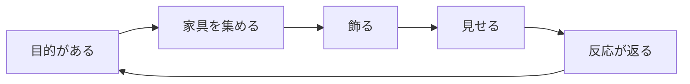

# ロードマップ ― My Little Room

## この文書の読み方

- フェーズは **どこで止めても遊べる形** で切っています。途中で方針を変えても捨てる作業が出ません。
- 規模は「1人開発・週10〜15時間」を前提にした**目安**です。人数が増えれば当然変わります。
- ★ がそのフェーズの主目的。それ以外は余力しだいで落として構いません。
- KPI の数値は**仮説として置いた目標値**です。実測が取れたら差し替えてください。

---

## 1. コンセプト

> **5分で「自分の部屋」が良くなって、そのままURLで人に見せられる箱庭。**

| | |
| --- | --- |
| プラットフォーム | ブラウザ（PC / スマホ）。インストール不要、アカウント不要で即プレイ |
| 想定プレイヤー | 昔ピグや箱庭系で部屋を作っていた層。1日5〜10分、ちょこちょこ触る |
| セッション設計 | 1回3〜5分 × 1日1〜2回。腰を据えて遊ぶゲームにはしない |

### 3本の柱

1. **自己表現** ― 部屋とアバターが「自分そのもの」になること。判断に迷ったら、表現の幅が増える方を選ぶ。
2. **見せられる** ― 作ったものを人に見せて反応が返ること。箱庭の満足はここで完成する。
3. **毎日ちょっと変わる** ― 訪れるたび小さな変化がある。大きな更新より、小さな新着。

---

## 2. 現状（v0.1）と、ループの穴

実装済みなのは**「飾る」**だけです。エディタとしては成立していますが、ゲームのループが閉じていません。

| ループの位置 | 現状 | 何が起きるか |
| --- | --- | --- |
| 目的がある | ✗ なし | 何をすればいいか分からない |
| 家具を集める | △ 最初から全部持っている | 集める喜びがゼロ。カタログを一巡したら終わり |
| **飾る** | ◎ 実装済み | ここは強い。手触りは良い |
| 見せる | ✗ なし | 作っても誰にも見られない |
| 反応が返る | ✗ なし | 続ける理由が生まれない |

**したがって最短の勝ち筋は「集める(v0.2) → 見せる(v0.3)」の順でループを閉じること。**
マルチプレイは効果が最大ですがコストと運用負荷も最大なので、先に v0.3 の URL 共有で
「見せたい需要が本当にあるか」を安く測ってから投資します。

---

## 3. 全体像

| Ver | テーマ | 主目的 | 規模の目安 |
| --- | --- | --- | --- |
| v0.2 | **あつめる** | 家具を集める動機と、毎日来る理由をつくる | 2週 |
| v0.3 | **みせる** | サーバー無しで部屋を共有し、需要を測る | 2週 |
| v0.4 | **そだてる** | 表現の天井を上げる（部屋拡張・壁面・リカラー） | 3週 |
| v0.5 | **いきている** | 何もしていない時間をかわいくする（演出・生活感） | 3週 |
| v1.0 | **いっしょに** | 同じ部屋に他人がいる（マルチプレイ） | 6週＋運用 |

---

## 4. フェーズ詳細

### v0.2 あつめる ― 経済とコレクション

**目的** ★ サンドボックスに「獲得」の軸を入れる。カタログをショップに変える。

**入れるもの**

- コイン。ショップで家具を購入。未所持の家具はショップに並ぶが設置はできない
- デイリーボーナス（初回訪問でコイン）＋ 連続日数のささやかな増分
- **模様替えミッション**（3件程度を日替わり）：「いすを3つ置く」「壁と床を同じ系統に」「ラグの上に机を置く」など、
  達成が**部屋を触ること自体**になる課題にする。作業感を出さないのが要点
- 家具を 21 種 → 50 種前後へ。レア度（ふつう / すこしレア / レア）で価格帯を分ける
- 「しまう」で売却も可能に（買値の半額）

**完了条件（DoD）**

- 初回起動時、部屋に置かれていない未所持家具が存在し、コインで買える
- 1日1回訪れると必ず何かもらえる／達成できるものがある
- 既存プレイヤーの部屋・アバター・所持家具が消えずに移行できる

**見る数字**

- D1 復帰率（目標 30%）／ 初回セッションでの購入数（目標 1件以上が 60%）
- ミッション達成率。3件中1件も達成されないなら課題設計を見直す

**実装の当たり所**

- ⚠️ **先にセーブのマイグレーションを作ること。** `state/save.ts` の `load()` は現在
  `parsed.version !== SAVE_VERSION` で `defaultSave()` に落ちるため、`SAVE_VERSION` を上げると
  **既存プレイヤーの部屋が消えます。** `migrate(v1 → v2)` を挟む形に変えるのが v0.2 の最初のタスク
- `SaveData` に `coins` / `owned`（所持数と別に「解禁済み」）/ `missions` / `lastVisit` を追加
- `FurnitureDef` に `price` と `rarity` を追加（型は `src/types.ts`）
- 家具の描画は手続き生成なので、**追加コストはデータ1行＋色の指定だけ**。ここが本作の構造的な強み。
  50種への拡張は `data/furniture.ts` の編集でほぼ済む
- 新規モジュール：`data/missions.ts`、`state/economy.ts`。UI は「かぐ」パネルにショップタブを追加

---

### v0.3 みせる ― 共有と訪問

**目的** ★ 作った部屋を他人に見せられるようにする。**サーバーを持たずに**。

**入れるもの**

- 「みせる」ボタン → 部屋の状態を圧縮して URL に埋め込み、コピー
- **訪問モード**：共有 URL を開くと、その部屋を自分のアバターで歩ける（読み取り専用・保存しない）
- 訪問先で「いいね」を押すと、URL に戻り値が乗らない代わりに**スクリーンショットに反映**される軽い演出
- キャンバスから PNG 保存（SNS 投稿用。ロゴと部屋名を焼き込む）
- 部屋名とひとことの設定

**完了条件（DoD）**

- URL ひとつで他人の部屋に入って歩ける。サーバー費用ゼロ
- スマホで共有 → 別端末で開く、が成立する
- 共有 URL がバックアップも兼ねる（localStorage が消えても復元できる）

**見る数字**

- 共有ボタンの押下率（目標 セッションの 15%）／共有 URL の開封数
- ここが伸びないなら **v1.0 のマルチプレイは投資しない**。判断ゲートとして使う

**実装の当たり所**

- `state/share.ts`：`CompressionStream('deflate-raw')` + base64url。家具20個で 1KB 未満なので URL に十分載る
- `RoomScene` に `mode: 'own' | 'visit'`。visit では編集 UI を隠し `persist()` を無効化。
  歩行・座る・カメラはそのまま使える（既存コードに手を入れる箇所が少ない）
- スクリーンショットは `game.renderer.snapshot()`。UI は DOM 側なので写らない点に注意（枠は別途描く）

---

### v0.4 そだてる ― 表現の天井を上げる

**目的** ★ 「置く場所がない／似た部屋になる」を解消する。

**入れるもの**

- 部屋の拡張：12×12 → 16×16 → 20×20 をコインで解放
- **壁面レイヤー**：窓、絵画、壁時計、壁掛け照明。等角の箱庭で最も「部屋らしさ」が伸びる要素
- 家具のリカラー（同じ形で色違い）。1種から 5〜6 バリエーションが作れるので**供給効率が最も高い**
- 床の部分張り替え（タイル単位）
- 部屋テーマのプリセット（ロココ / 和 / カフェ / パステル）
- 複数部屋（2部屋目以降を解放）

**完了条件（DoD）**

- 壁に物が掛かる。床が1マス単位で塗れる。同じ家具で色の違う部屋が作れる

**実装の当たり所**

- `ROOM_W / ROOM_H` は定数なので、`RoomState` に持たせて `RoomView` / `FurnitureLayer` / `pathfinding` へ渡す形に変更
- 壁面は床グリッドと別物。`WallLayer` を新設し、壁の (辺, 列, 高さ) をスロットとして持たせる
- リカラーは `getFurnitureTexture()` のキャッシュキーに色を含めるだけで済む
- ⚠️ **大型家具を増やす前に重なり順を直す。** 現在 家具どうしの前後は
  `depthFor()` のスカラー近似で、同順位のときの保証がない。アバターに使っている
  `FurnitureLayer.depthAt()` と同じ判定を家具間にも広げ、トポロジカルソートにする

---

### v0.5 いきている ― 生活感と演出

**目的** ★ 何もしていない時間を「かわいい」にする。滞在時間と再訪の質を上げる。

**入れるもの**

- 家具インタラクション：ベッドで寝る、テレビを見る、ピアノを弾く、鏡を見る（座る仕組みの拡張）
- アバターのモーション／エモート（拍手・おじぎ・喜ぶ）とスタンプ
- 時間帯（朝・昼・夕・夜）で壁と床の色調が変わる。夜はランプが点く
- ペット（歩き回る小さなアバター）と、たまに来る NPC の来客
- 放置アニメ（あくび、伸び、鼻歌）

**完了条件（DoD）**

- 30秒操作しなくても画面が退屈にならない
- 家具の半分以上に「クリックすると何か起きる」がある

**実装の当たり所**

- `FurnitureDef` の `seatHeight` を `interactions: { kind, pose, lift }[]` に一般化
- 時間帯は `RoomView.redraw()` に色調フィルタを1段足すだけ（実装が軽く、効果が大きい）
- ペットは `Avatar` の簡易版。経路探索とアバター描画をそのまま流用できる

---

### v1.0 いっしょに ― マルチプレイ

**目的** ★ 同じ部屋に他人がいる状態をつくる。**v0.3 の共有が伸びていることが着手条件。**

**入れるもの**

- WebSocket サーバー（Node）。部屋の状態は `SaveData` と同形のスナップショット、権威はオーナー
- 同室での歩行・チャット・エモートの同期。フレンド、部屋訪問、いいね
- 運用機能：通報 / ミュート / ブロック、チャットの NG ワード、名前の重複回避

**完了条件（DoD）**

- 4人が同じ部屋で歩いてチャットでき、1人が落ちても他が壊れない
- 通報とミュートが動く（**これが無い状態で公開しない**）

**実装の当たり所**

- `Avatar` を複数インスタンス化するだけ。座標系・経路探索・`depthAt()` は
  プレイヤー数に依存しない作りにしてあるので、描画側の改造はほぼ不要
- 同期は位置の補間（クライアント側で目標マスへ歩かせる）で足りる。予測や巻き戻しは不要
- ⚠️ ここから**運用コストと責任**が発生する。サーバー費・モデレーション・年齢層への配慮を
  企画として先に決めること。技術より重い

---

### v1.x その先

- シーズン家具（月替わりの新着。供給を止めないための仕組み）
- 部屋自慢コンテスト／週替わりテーマとランキング
- UGC：プレイヤーが家具の色と形を組み合わせて作れるエディタ（手続き生成の資産が効く）
- 実績・図鑑（コレクションの可視化）

---

## 5. 見る数字

**北極星指標：1日に1回以上「部屋を編集した」ユーザー数**
（訪問数ではなく編集数。このゲームの価値は編集にあるため）

| フェーズ | 進む判断ライン（仮） |
| --- | --- |
| v0.2 → v0.3 | D1 復帰 30% / 初回セッションの購入率 60% |
| v0.3 → v0.4 | 共有ボタン押下率 15% / 共有URLの開封が発行数の 50% |
| v0.4 → v0.5 | D7 復帰 12% / 1人あたり設置家具数の中位値 25個 |
| v0.5 → v1.0 | **共有と再訪が伸びている**こと。ここが未達ならマルチは作らない |

計測は最小限で構いません（`localStorage` に自前カウンタ → 集計は後から）。
数字を取る仕組みを v0.2 と同時に入れておくこと。**後付けは必ず後回しになります。**

---

## 6. リスクと打ち手

| リスク | 影響 | 打ち手 |
| --- | --- | --- |
| サンドボックスは「作り終わると飽きる」 | 致命的 | 供給（新家具）と目的（ミッション）を止めない。v1.x のシーズン家具まで見据える |
| セーブが localStorage のみ。端末を変えると消える | 大 | v0.3 の共有 URL をバックアップ兼用にする。アカウントは急がない |
| `SAVE_VERSION` を上げると既存の部屋が消える | 大 | v0.2 の最初にマイグレーションを実装（詳細は上記） |
| 家具が増えて描画順が崩れる | 中 | v0.4 の前にトポロジカルソート化 |
| マルチプレイの運用負荷（モデレーション） | 大 | v0.3 の数字で需要を確認してから着手。通報機能なしで公開しない |
| バンドルが 1.5MB（Phaser 全部入り） | 小 | スマホの初回読み込みが問題になったらカスタムビルドを検討。今は許容 |

---

## 7. 技術的な下ごしらえ

着手のタイミングを間違えると高くつくものだけ挙げます。

| 項目 | いつやるか | 理由 |
| --- | --- | --- |
| セーブのマイグレーション基盤 | **v0.2 の最初** | これ以降すべての機能追加が `SaveData` を触る |
| 計測カウンタ | v0.2 と同時 | 後付けは必ず後回しになる |
| コアのユニットテスト（`core/iso`、`pathfinding`、`canPlace`） | v0.2 中 | 座標と占有マスの回帰は目視で気づけない。Vitest で十分 |
| 家具どうしの重なり順のトポロジカルソート | **v0.4 の前** | 大型家具・壁面家具を増やすと近似が破綻する |
| 部屋サイズの可変化 | v0.4 の最初 | 定数のまま機能を積むと後で全部触ることになる |
| Phaser のカスタムビルド | 必要になったら | 今は問題になっていない |

---

## 8. やらないこと（Non-goals）

明示的に**やらない**と決めておくもの。迷ったらここに戻ります。

- **ガチャ／課金前提の設計**。射幸性でリテンションを作ると、箱庭の「自分らしさ」が薄まる
- **リアルタイム対戦・スコア競争**。このゲームの快感は勝ち負けではない
- **3D化**。等角の手描き感が本作の個性であり、手続き生成の資産をすべて捨てることになる
- **重いチュートリアル**。触れば分かる操作にすることで代替する
- **アカウント登録の必須化**。「開いたらすぐ遊べる」を最優先の価値として守る
